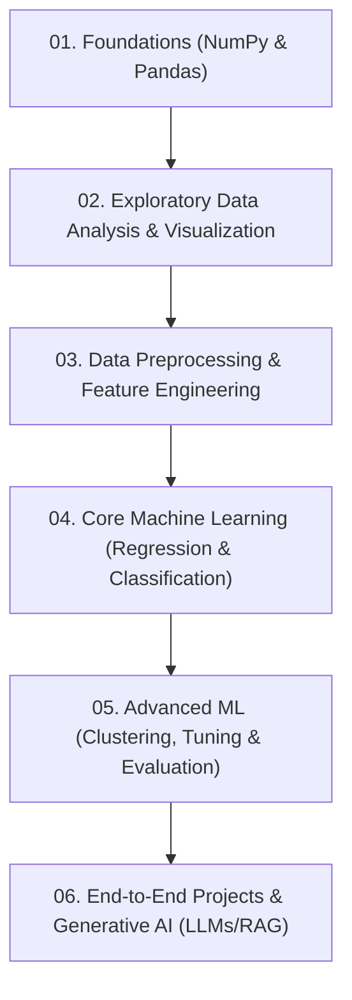

# 🎓 Complete Machine Learning Portfolio & Learning Journey

[](https://www.python.org/)
[](https://scikit-learn.org/)
[](https://streamlit.io/)
[](https://langchain.com/)
[](./LICENSE)

---

## 🌟 Introduction

Welcome to my **Machine Learning & Artificial Intelligence Portfolio**! This repository documents my comprehensive, end-to-end learning journey, algorithm implementations, exploratory analyses, model optimizations, interview preparations, and real-world projects.

Every notebook, script, dataset integration, and documentation entry here has been designed, coded, and curated by me. It represents a structured, bottom-up path starting from numeric computing foundations to building production-ready Generative AI systems.

---

## 🗺️ Learning Roadmap & Table of Contents

This repository is structured sequentially to follow a rigorous machine learning engineering learning curriculum:



### 📋 Interactive Table of Contents

1. **[Foundations & Array Computing](./01_NumPy/)**
   - High-performance vector operations, matrix manipulation, indexing, and linear algebra fundamentals.
2. **[Structured Data Manipulation](./02_Pandas/)**
   - Data cleaning, boolean masking, grouping, aggregations, and advanced time-series parsing.
3. **[Exploratory Data Analysis & Visualization](./03_Data_Visualization/)**
   - Core plotting mechanics (line/bar/pie charts), statistical correlation analysis, and distribution checks.
4. **[Preprocessing & Feature Engineering](./04_Data_Preprocessing/)**
   - Outlier detection (IQR & Z-Score), categorical encoding (One-Hot, Ordinal, Target), feature scaling, and Scikit-Learn Pipelines.
5. **[Predictive Modeling & Core ML](./05_Machine_Learning/)**
   - **[Regression](./05_Machine_Learning/Regression/)**: Linear & Polynomial models, overfitting diagnostic techniques, Random Forest Regressors, and XGBoost Regressors.
   - **[Classification](./05_Machine_Learning/Classification/)**: Logistic Regression theoretical models, Decision Trees, Ensemble Random Forest Classifiers, and XGBoost Classifiers.
   - **[Clustering](./05_Machine_Learning/Clustering/)**: Unsupervised K-Means clustering, Within-Cluster Sum of Squares (Inertia), and Elbow Method.
   - **[Model Evaluation & Tuning](./05_Machine_Learning/Model_Evaluation/)**: Precision, Recall, F1, ROC-AUC, Confusion Matrix analysis, and GridSearchCV hyperparameter tuning.
6. **[Portfolio Projects](./06_Projects/)**
   - **[Loan Approval Prediction](./06_Projects/01_Loan_Approval_Prediction/)**: Binary classification pipeline to determine credit approval.
   - **[Google Play Store Analysis](./06_Projects/02_Google_Play_Store_Analysis/)**: EDA, cleansing, and multi-dimensional distribution insights.

---

## 📂 Repository Structure

Below is the directory mapping of the workspace:

```text
├── .gitignore
├── LICENSE
├── README.md                          # Root portfolio index
├── requirements.txt                   # Project-wide dependencies
├── 01_NumPy/                          # Foundational vector math
│   ├── 01_NumPy_Basics.ipynb
│   └── README.md
├── 02_Pandas/                         # Tabular data manipulation
│   ├── 01_Pandas_Fundamentals.ipynb
│   └── README.md
├── 03_Data_Visualization/             # Data plotting & distributions
│   ├── 01_Matplotlib_Fundamentals.ipynb
│   ├── 02_Seaborn_Advanced_Plots.ipynb
│   ├── 03_Visualization_Exercises.ipynb
│   └── README.md
├── 04_Data_Preprocessing/             # Pipelines, scalers & encoders
│   ├── 01_Outlier_Detection_and_Handling.ipynb
│   ├── 02_Exploratory_Data_Analysis.ipynb
│   ├── 03_Categorical_Encoding.ipynb
│   ├── 04_Column_Transformers_and_Pipelines.ipynb
│   └── README.md
├── 05_Machine_Learning/               # Algorithms & models
│   ├── README.md
│   ├── Regression/                    # Linear, Poly, Random Forest, XGBoost
│   ├── Classification/                # Logistic, Trees, Ensembles, XGBoost
│   ├── Clustering/                    # Unsupervised K-Means
│   └── Model_Evaluation/              # GridSearchCV, Confusion Matrices, ROC
├── 06_Projects/                       # End-to-end applications
│   ├── 01_Loan_Approval_Prediction/   # Loan approval classifier
│   └── 02_Google_Play_Store_Analysis/ # App store EDA pipeline
├── datasets/                          # Cleaned & raw CSV datasets
│   └── README.md
└── images/                            # Project assets & plots
```

---

## 🛠️ Technologies & Tools Used

| Domain | Libraries & Tools |
| :--- | :--- |
| **Languages** | Python (3.9+) |
| **Scientific Computing** | NumPy, Pandas |
| **Data Visualization** | Matplotlib, Seaborn |
| **Machine Learning** | Scikit-Learn, XGBoost |

---

## 🚀 How to Use This Repository

### 1. Prerequisites
Ensure you have Python 3.9 or higher installed on your computer.

### 2. Set Up Environment
```bash
# Clone the repository
git clone https://github.com/aditya001-001/Machine-learning.git
cd Machine-learning

# Create virtual environment
python -m venv venv

# Activate virtual environment
# On Windows:
venv\Scripts\activate
# On macOS/Linux:
source venv/bin/activate

# Install dependencies
pip install -r requirements.txt
```

### 3. Running Notebooks
Launch Jupyter Notebook or VS Code Jupyter Extension to step through individual files:
```bash
jupyter notebook
```

---

## 📈 Future Learning Goals

- Explore **Deep Learning** with PyTorch (specifically MLPs, CNNs, and LSTMs).
- Dive deeper into **Natural Language Processing (NLP)**, fine-tuning Hugging Face Transformers.
- Deploy models using **Docker, FastApi, and AWS (EC2/S3)**.
- Implement **MLOps** tracking using MLflow.

---

## Created & Maintained By

**Aditya Sarapure**

*This repository represents my personal Machine Learning learning journey. Every implementation, notebook, experiment, and note has been developed, organized, and maintained by me for educational and portfolio purposes.*
